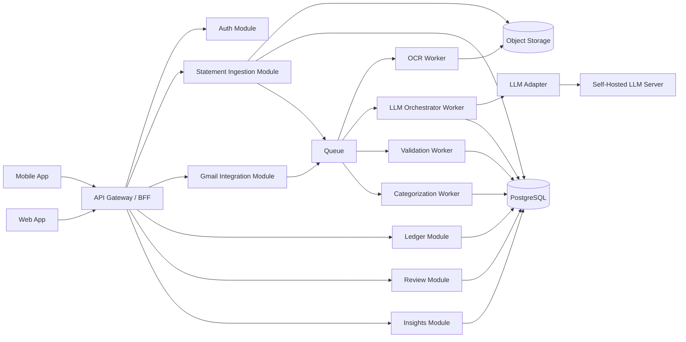
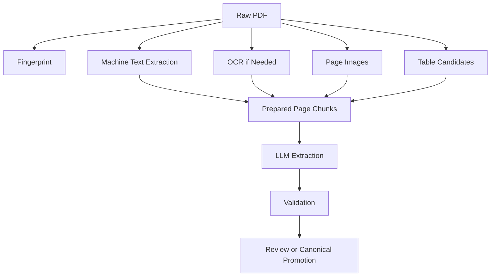
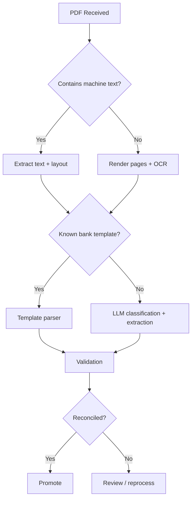
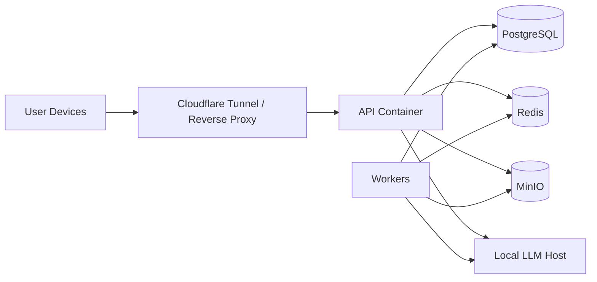

# HisabClub Architecture Blueprint

## 1. Title and Executive Summary

### 1.1 Title
**HisabClub: Privacy-First Indian Personal Finance Platform Architecture**

### 1.2 Executive Summary
HisabClub is a personal finance platform for Indian users who manage multiple savings accounts, current accounts, and credit cards across multiple institutions. The core product promise is to ingest financial records from uploaded documents (PDF plus selected spreadsheet formats) and Gmail attachments, extract transactions using a hybrid deterministic + LLM pipeline, reconcile and normalize those records into a trustworthy personal ledger, and surface spending, transfer, tax, and billing insights without leaking sensitive financial data to third-party AI providers.

This architecture is designed around five non-negotiable principles:

1. **Financial correctness over convenience**
   - LLM output is never blindly trusted.
   - Every extraction result must pass validation, reconciliation, and duplicate controls before promotion into canonical ledger state.

2. **Privacy-first processing**
   - Uploaded statements, Gmail attachments, OCR text, embeddings, and prompts must stay local by default.
   - Self-hosted inference is a first-class deployment path, not an afterthought.

3. **Separation of raw evidence from approved finance records**
   - Raw extracted rows, model outputs, and canonical transactions are stored separately.
   - Human review and reprocessing operate on raw evidence, not on user-approved ledger state.

4. **Deterministic core with LLM augmentation**
   - Deterministic parsers handle known banks and stable templates.
   - OCR, classification, normalization, categorization, anomaly detection, and difficult layouts use LLMs behind schema-enforced orchestration.

5. **Operational realism**
   - Queue-based asynchronous processing, idempotency keys, audit logs, secure storage, retries, re-review flows, and deletion workflows are designed in from day one.

### 1.3 Recommended Delivery Posture
The recommended implementation path is:

- **Application topology**: monorepo
- **Deployment topology**: modular monolith backend + async workers + self-hosted LLM gateway + PostgreSQL + object storage
- **Frontend**: React web and React Native mobile
- **Backend**: FastAPI
- **Queueing**: Redis-backed jobs initially, Kafka/NATS later if needed
- **Storage**: PostgreSQL + S3-compatible object storage
- **Inference**: OpenAI-compatible adapter against self-hosted `llama.cpp`, `vLLM`, `TGI`, or `Ollama`

This yields high implementation speed for MVP while preserving clear service boundaries for later extraction into separate services.

---

## 2. Product Scope and Assumptions

### 2.1 In Scope

- Mobile app for Android-first users, later iOS
- Web app for upload, review, analytics, settings, and ops
- Backend platform for:
  - auth
  - account/card management
  - statement ingestion
  - Gmail integration
  - extraction orchestration
  - ledger normalization
  - categorization
  - review workflows
  - dashboard insights
  - tax-oriented reporting
- Self-hosted LLM support
- Gmail permission-based import of statement emails and attachments
- User upload of:
  - savings account statements
  - current account statements in future
  - credit card statements
  - interest certificates
  - tax/demat supporting documents in `pdf/xlsx/xls/csv`

### 2.2 Out of Scope for MVP

- Bank API integrations through account aggregators
- Direct UPI PSP integrations
- Live transaction scraping from internet banking portals
- Auto-tax filing submission
- Investment execution
- Net worth tracking across brokers and mutual funds beyond document ingestion

### 2.3 Assumptions

- Users will supply statement PDFs manually or via Gmail sync.
- Users may also upload tax/demat support documents as `xlsx/xls/csv`.
- Many statement PDFs will be password protected.
- Some PDFs will contain machine-readable text; others will be scanned images.
- Statement formats will vary heavily by bank, product, and statement year.
- Users care about privacy and will prefer local/self-hosted AI where possible.
- Product correctness matters more than same-minute import completion.
- Human review is acceptable when confidence is low.

---

## 3. Functional Requirements

### 3.1 Primary User Workflows

- Register/login
- Connect Gmail via OAuth
- Configure sender allowlist and sync window
- Upload one or more supported files manually (`pdf/xlsx/xls/csv`)
- Select statement type:
  - auto
  - bank account statement
  - credit card statement
- Enter PDF password when required (PDF files only)
- Track ingestion status:
  - uploaded
  - under review
  - parsed
  - review required
  - failed
- View statement metadata and original source file
- Review extracted transactions
- Approve or edit incorrect rows
- Delete statement and all associated extraction memory
- Re-review statement using newer model/prompt/parser
- View unified transaction ledger
- Filter by bank, account, card, date, category, merchant, transfer type
- View dashboards:
  - cashflow
  - category spend
  - credit card due summary
  - tax and compliance cues
  - transfer matching

### 3.2 India-Specific Domain Support

- Savings account statements
- Current account statements later
- Credit card statements
- UPI credits/debits
- IMPS / NEFT / RTGS / ACH / ECS / NACH
- ATM withdrawals
- POS spends
- Salary credits
- Interest credits
- Cash deposits
- EMI debits
- Credit card bill payments
- Refunds and reversals
- annual fees / finance charges / GST / late fees
- reward points when present
- opening/closing balance extraction
- card due date / minimum due / total due
- masked account/card number inference
- Indian date formats:
  - `DD/MM/YYYY`
  - `DD-MM-YYYY`
  - `DD Mon YYYY`
- currency normalization to INR
- debit/credit ambiguity resolution:
  - DR/CR columns
  - separate withdrawal/deposit columns
  - negative sign formats
  - trailing `Cr` or `Dr`

### 3.3 Administrative Workflows

- Review parser support gaps
- Review failed documents
- Compare parser performance by bank
- Benchmark models/prompts
- Audit reprocessing events
- Review Gmail sync health
- Purge user data on request

---

## 4. Non-Functional Requirements

### 4.1 Correctness

- No unvalidated LLM output may directly create canonical ledger records.
- All parsed statements must pass reconciliation checks or be marked review-required.
- Duplicate ingestion must be idempotent at file, statement, and transaction levels.

### 4.2 Privacy

- Default mode must keep PDFs, OCR text, embeddings, prompts, and outputs local.
- Logs must never contain full statement contents, PAN, Aadhaar, full account numbers, or full card numbers.

### 4.3 Performance

- Upload acknowledgement: under 2 seconds
- Parsing kickoff: under 5 seconds
- Typical statement extraction:
  - known parser: under 15 seconds
  - OCR + LLM: under 2 minutes
- Dashboard queries: under 500 ms for common filters after indexing

### 4.4 Reliability

- Background processing with retries
- Dead letter queue for persistent failures
- Idempotent replays
- Re-review support with immutable attempt history

### 4.5 Auditability

- Every extraction attempt must record:
  - model
  - prompt version
  - parser version
  - input hash
  - validation results
  - operator or system trigger

### 4.6 Extensibility

- Adding a new parser must not require touching unrelated business logic.
- Swapping model providers must not require changes to extraction services.

---

## 5. High-Level Architecture Overview

### 5.1 Recommended Topology
Use a **modular monolith with explicit service modules** for MVP and early scale. Split into separate deployables only when throughput or team boundaries justify it.



### 5.2 Architectural Recommendation

| Option | Pros | Cons | Recommendation |
|---|---|---|---|
| Pure microservices from day one | Strong isolation, independent scale | Excessive complexity, coordination overhead, distributed failures | Reject for MVP |
| Modular monolith + workers | Fast implementation, simpler transactions, easy refactor later | Some modules share runtime fate | **Recommended** |
| Serverless-heavy ingestion | Cheap burst scaling | Poor fit for GPU/LLM, hard local deployment | Reject as primary design |

### 5.3 Key Design Choice
The backend should behave as a **single product platform** while internally maintaining strict service boundaries:

- auth and identity
- ingestion
- document processing
- extraction orchestration
- ledger normalization
- categorization
- Gmail sync
- review and audit
- analytics

Each module owns tables, APIs, events, and failure modes even if deployed in one codebase.

---

## 6. Recommended Tech Stack

### 6.1 Stack Summary

| Layer | Recommended | Alternatives | Why |
|---|---|---|---|
| Mobile | React Native + Expo dev workflow, bare/native modules where needed | Flutter | Existing ecosystem fit, fast iteration, Android-first practicality |
| Web | React + TypeScript + Vite | Next.js | SPA is sufficient; backend serves built assets in simple deployments |
| Backend API | FastAPI + SQLAlchemy + Pydantic | Django, NestJS | Strong typing, good async support, easy OpenAI-compatible integrations |
| Background Jobs | Dramatiq or RQ on Redis | Celery, Arq | Simple queue model, operationally lighter than Celery |
| DB | PostgreSQL 16 + pgvector | MySQL | Best fit for relational ledger + JSONB + vector search |
| Object Storage | S3-compatible storage (MinIO local, S3/R2 in cloud) | local FS only | Durable document storage + signed URL model |
| OCR | `ocrmypdf` + `tesseract` + `pymupdf` + `pdfplumber` + `camelot/tabula` selectively | cloud OCR | Privacy-first local pipeline |
| LLM Inference | OpenAI-compatible adapter over `vLLM` or `llama.cpp`; `Ollama` acceptable for dev | hosted APIs | Supports self-hosted and provider abstraction |
| Embeddings | local bge/e5 family via sentence-transformers or TEI | OpenAI embeddings | Keeps retrieval local |
| Auth | JWT session tokens + refresh tokens, Argon2 passwords, OAuth for Gmail | Auth0, Clerk | Financial data favors direct control |
| Notifications | SMTP + push later + in-app notification feed | SendGrid, Firebase only | Start with email + app notifications |
| Observability | OpenTelemetry + Prometheus + Grafana + Loki | Datadog | Works local and cloud |
| Secrets | Doppler/1Password/KMS in cloud; `.env` in dev | plain env everywhere | Better secret hygiene |
| Deployment | Docker Compose for local/self-hosted; Kubernetes for cloud scale | Nomad | Compose is simplest for homelab; K8s only when justified |

### 6.2 LLM Model Split

| Role | Model Class | Example |
|---|---|---|
| Document classification | small instruct model | Qwen 7B / Llama 8B |
| Statement metadata extraction | medium instruct model | Qwen 14B |
| Difficult transaction extraction | larger instruct model | Qwen 32B / Mistral Large local equivalent |
| Merchant/category normalization | small fast model | Qwen 7B |
| User-facing insights chat | medium/large model | Qwen 14B/32B |
| Embeddings | local embedding model | `bge-m3`, `e5-large-v2` |

### 6.3 Why Not One Model for Everything

- Extraction requires schema discipline and long context.
- Categorization benefits from low-latency cheap inference.
- User insight generation can tolerate a higher-latency conversational model.
- Small, specialized workloads lower GPU pressure and cost.

---

## 7. Detailed Component/Service Architecture

### 7.1 Service Boundary Table

| Component | Responsibility | Owns Data | Depends On | Failure Modes | Scaling Pattern |
|---|---|---|---|---|---|
| Mobile App | Upload, review, dashboard, notifications | local cache only | API Gateway | offline sync issues, upload retries | scales by users |
| Web App | Admin-grade review, bulk upload, analytics | browser cache | API Gateway | large file upload UX issues | scales by users |
| API Gateway / BFF | auth, routing, response shaping | none, orchestration only | all backend modules | auth bottleneck, rate limit pressure | horizontal stateless |
| Auth Service | registration, login, token minting, password reset | users, sessions, reset tokens | email provider | brute force, token misuse | horizontal stateless + DB |
| User Service | profile, preferences, notification settings | user settings | auth | stale preferences | horizontal stateless |
| Account & Card Service | account/card identity, aliases, bank mapping | institutions, accounts, cards | ledger, extraction | wrong mapping, duplicates | DB-bound |
| Statement Ingestion Service | upload registration, file fingerprinting, storage | raw_pdfs, statements shell rows | object storage, queue | large file failure, malware block | I/O-bound |
| Document Storage Service | store and retrieve PDFs, OCR artifacts | object refs | object storage | missing object, permission leak | storage-bound |
| OCR / Parsing Service | text extraction, OCR, table extraction, parser routing | statement_pages, page artifacts | object storage, OCR tools | OCR failure, malformed PDF | worker horizontal |
| LLM Orchestration Service | prompt packing, model calls, schema enforcement | llm_requests, llm_outputs, extraction_attempts | LLM adapter, knowledge store | timeout, invalid JSON, hallucination | worker + GPU aware |
| Extraction Validation Service | reconcile totals, validate rows, confidence scoring | validation outputs | statements, raw extractions | false rejects, false accepts | worker horizontal |
| Transaction Ledger Service | canonical transaction promotion, dedup, merges | normalized_transactions, transaction sources | validation | duplicate merge bugs | DB-bound |
| Categorization Engine | merchant normalization, rule/LLM category assignment | merchant_aliases, category mappings | LLM service, ledger | unstable labels | worker horizontal |
| Gmail Integration Service | OAuth, message search, attachment ingest | connected_accounts, ingested_emails, email_attachments | Gmail API, queue | revoked token, quota | I/O-bound |
| Notification Service | in-app/email notifications | notifications | auth, extraction, review | duplicate notices, SMTP failure | horizontal |
| Review Service | human review queues and corrections | review_tasks, overrides | ledger, extraction | stale task state | DB-bound |
| Analytics / Reporting Service | dashboard views, tax summaries, trends | aggregates, cached views | ledger | slow queries | read scaling |
| Audit & Compliance Service | audit trail, deletion workflow, legal hold metadata | audit_logs | all services | missing events | append-heavy |

### 7.2 Preferred Runtime Shape

- `api` process:
  - FastAPI app
  - serves API and built web
  - stateless
- `worker-ingest`
  - handles file registration, classification kickoff
- `worker-doc`
  - PDF text extraction, OCR, page artifact generation
- `worker-llm`
  - prompt packing, LLM extraction, categorization
- `worker-validation`
  - reconciliation, confidence aggregation, review task creation
- `worker-email`
  - Gmail sync
- `llm-gateway`
  - OpenAI-compatible adapter and model registry client
- `db`
  - PostgreSQL + pgvector
- `object-storage`
  - MinIO/S3
- `redis`
  - queue broker + cache + rate limit backend

### 7.3 Modular Monolith Packaging

- `modules/auth`
- `modules/users`
- `modules/accounts`
- `modules/ingestion`
- `modules/document_processing`
- `modules/llm`
- `modules/validation`
- `modules/ledger`
- `modules/review`
- `modules/gmail`
- `modules/notifications`
- `modules/insights`
- `modules/audit`

Each module exposes:

- service layer
- repository layer
- API handlers
- events
- background jobs
- validation contracts

---

## 8. Document Ingestion Architecture

### 8.1 Ingestion Principles

- Every incoming file becomes a **document artifact** before it becomes a statement.
- Fingerprint the file before any parsing to enable deduplication.
- Preserve raw file unchanged.
- Store derived artifacts separately:
  - extracted machine text
  - OCR text
  - page images
  - table candidates
  - layout metadata

### 8.2 Upload Pipeline

1. Client uploads supported file with metadata:
   - source = manual
   - bank hint optional
   - account type hint optional
   - document type hint (`auto` or explicit)
   - password optional (PDF only)
2. API stores file to object storage or encrypted file system.
3. API computes:
   - SHA-256 hash
   - file size
   - MIME type
   - page count if readable
4. API checks duplicate file hash.
5. API creates `raw_pdfs` record with status `uploaded`.
6. API enqueues `document.process`.
7. User receives immediate response with `document_id` and status feed reference.

### 8.3 Input Controls

- Accept `application/pdf`, `application/vnd.openxmlformats-officedocument.spreadsheetml.sheet`, `application/vnd.ms-excel`, `text/csv`
- max upload size configurable
- password field optional (PDF)
- malware scanning before queue
- PDF parser sandboxing for PDF statement path
- file hash computed on stream

### 8.4 Statement Type Selection Strategy

User may choose:

- `auto`
- `bank_account`
- `credit_card`

System behavior:

- If explicit type is provided, treat as strong hint, not absolute truth.
- If extraction evidence contradicts the hint, mark `hint_conflict=true` and create a review signal.
- In `auto`, classifier decides based on page headers, balance vocabulary, due-date vocabulary, and transaction semantics.

### 8.5 Artifact Model



---

## 9. Gmail Integration Architecture

### 9.1 Gmail Use Case
Users grant Gmail read access. The system identifies likely statement emails, fetches metadata and PDF attachments, and routes them through the same ingestion pipeline as manual uploads.

### 9.2 Gmail Scope Recommendation

- Prefer minimal scopes:
  - `gmail.readonly`
  - `userinfo.email`
  - `openid`
- Avoid sending or mailbox modification for MVP.

### 9.3 Gmail Data Flow

1. User initiates OAuth in web/mobile.
2. Backend creates OAuth state and PKCE verifier.
3. User consents in Google.
4. Backend receives auth code.
5. Tokens are encrypted and stored in `connected_accounts`.
6. Sync job searches messages matching:
   - approved senders
   - attachment present
   - date window
   - statement-related keywords
7. Messages are deduplicated using Gmail message ID + attachment hash.
8. Matching PDF attachments are downloaded to temp storage.
9. Attachments are registered as `raw_pdfs` with source `gmail`.
10. Standard document processing begins.

### 9.4 Gmail Message Search Strategy

- Sender allowlist per user
- Query fragments:
  - `from:hdfcbank`
  - `from:axisbank`
  - `filename:pdf`
  - `has:attachment`
  - date filters
- Secondary heuristic on subject/body:
  - `statement`
  - `credit card`
  - `account statement`
  - `e-statement`
  - `monthly statement`

### 9.5 Gmail Security Controls

- OAuth tokens encrypted at rest
- token refresh server-side only
- no raw email bodies in logs
- attachment bytes stored only after sender and MIME pre-check
- user can disconnect account and wipe synced metadata

### 9.6 Failure Modes

| Failure | Handling |
|---|---|
| token revoked | mark account disconnected, notify user |
| Gmail quota exceeded | exponential backoff, retry later |
| attachment download partial | retry attachment only |
| duplicate attachment | mark deduped, skip parse |
| unsupported MIME | ignore and audit |

---

## 10. LLM Orchestration Architecture

### 10.1 Core Principle
The LLM orchestration layer is an **evidence-to-JSON service**, not a general chat service. It receives prepared context from document processing and returns schema-constrained outputs that are then independently validated.

### 10.2 Why an LLM Adapter Layer Is Required

The business logic must not know whether inference is handled by:

- `llama.cpp`
- `vLLM`
- `TGI`
- `Ollama`
- local OpenAI-compatible reverse proxy
- hosted OpenAI-compatible endpoint in exceptional deployments

The adapter must normalize:

- base URL
- auth header
- model name
- context window
- timeout
- retries
- temperature
- JSON mode/tool schema capabilities
- rate limit behavior

### 10.3 LLM Provider Abstraction

```python
class LLMProvider(Protocol):
    def generate_structured(
        self,
        model: str,
        messages: list[ChatMessage],
        schema: dict,
        timeout_s: int,
        temperature: float,
        max_tokens: int,
        metadata: dict,
    ) -> StructuredResult:
        ...

class EmbeddingProvider(Protocol):
    def embed(self, model: str, inputs: list[str]) -> list[list[float]]:
        ...
```

### 10.4 Adapter Configuration Model

```json
{
  "provider_id": "local-qwen-primary",
  "provider_type": "openai_compatible",
  "base_url": "http://llm-gateway:8000/v1",
  "api_key_secret_ref": "secrets/llm/local_primary",
  "default_model": "qwen3.5-27b-instruct",
  "max_context_tokens": 32768,
  "timeout_seconds": 90,
  "max_retries": 2,
  "supports_json_schema": true,
  "supports_tool_calling": false,
  "enabled": true
}
```

### 10.5 Model Routing Strategy

| Task | Preferred Model | Fallback | Notes |
|---|---|---|---|
| document classification | small fast model | deterministic rules only | low latency |
| statement metadata extraction | medium model | larger model | extract bank, period, due, masked id |
| transaction extraction | deterministic parser first; large model fallback | OCR + large model | highest-risk task |
| merchant cleanup | small model | rule-based aliasing only | low cost |
| categorization | rules + small model | user override only | asynchronous |
| transfer matching reasoning | rules + medium model | rules only | needs relational reasoning |
| insight generation | medium/large model | disabled | read-only narrative |

### 10.6 Queue-Based LLM Workload Design

- `document.classify`
- `statement.extract.metadata`
- `statement.extract.transactions`
- `statement.normalize.lineitems`
- `statement.reconcile`
- `transaction.categorize`
- `transaction.reclassify.transfer`
- `insight.generate.monthly`

Each job stores:

- input hash
- document ID
- user ID
- model config ID
- prompt version
- retry count
- status

### 10.7 Self-Hosted Inference Considerations

#### For homelab / privacy-first deployment
- Prefer `llama.cpp` or `Ollama` for simplicity
- CPU fallback possible, but transaction extraction latency will increase sharply
- GPU VRAM target:
  - 8-16 GB: small models only
  - 24 GB: practical for 14B-32B quantized extraction workloads
  - 48 GB+: comfortable concurrent extraction

#### For cloud
- Prefer `vLLM` for throughput and batching
- Keep classification/categorization models separate from extraction model
- Place GPU worker behind internal network only

### 10.8 Structured Output Enforcement

Preferred order:

1. provider-native JSON schema mode
2. tool-call style JSON arguments
3. strict JSON prompt with repair loop

Never accept:

- free-form prose as final extraction
- partial list without explicit error section
- mixed commentary plus JSON

### 10.9 Hallucination Reduction Strategy

- Limit input to extracted evidence only
- include explicit “do not infer missing transactions”
- require `evidence_span` or `source_page`
- require `confidence`
- reject rows with impossible amounts/dates
- reconcile totals against statement summary
- compare extracted row count to line candidates
- use deterministic parser when supported

### 10.10 Retry and Fallback Policy

1. deterministic parser
2. OCR if no machine text
3. small model classify + metadata extract
4. large model transaction extraction
5. repair pass if JSON invalid
6. fallback model if extraction quality poor
7. create review task if still low confidence

---

## 11. PDF/OCR/Text/Table Extraction Strategy

### 11.1 Extraction Decision Tree



### 11.2 Machine Text Extraction

Use:

- `pymupdf` for page text blocks and coordinates
- `pdfplumber` for fine-grained text lines and tables
- `camelot` or `tabula` when tables are obvious and text PDFs are well-formed

Store per page:

- raw text
- block coordinates
- line candidates
- table candidates
- page dimensions

### 11.3 OCR Path

Use OCR only when:

- extracted machine text is empty or very low density
- extracted text appears garbled
- a high image-only page ratio is detected

Recommended OCR pipeline:

1. render page image at 200-300 DPI
2. deskew / binarize
3. OCR via Tesseract
4. optionally `ocrmypdf` to produce searchable PDF
5. keep OCR confidence per block

### 11.4 Page-Level vs Document-Level Prompting

| Strategy | Use When | Pros | Cons | Recommendation |
|---|---|---|---|---|
| document-level only | short, clean statements | simple | poor for long statements | not primary |
| page-level only | scanned, long PDFs | local focus | cross-page totals harder | partial use |
| logical chunking | transaction tables span ranges | best locality | requires preprocessing | **recommended** |
| summary + chunk hybrid | long statements with summary pages | preserves totals + details | more orchestration | **recommended** |

### 11.5 Recommended Chunking Strategy

- Extract statement summary pages separately
- Extract transaction pages into logical chunks of 1-3 pages
- Keep page references in each chunk
- Maintain a document-level envelope:
  - bank hint
  - account/card hint
  - date hints
  - page roles
  - opening/closing balance candidates
  - due/min due candidates

### 11.6 Table Extraction Strategy

Do not ask the LLM to discover tables from raw binary PDFs directly. Instead:

1. Precompute line groups and table candidates
2. Serialize them into a compact intermediate format
3. Include only the most relevant columns
4. Preserve ambiguous rows with page/line references

Intermediate example:

```json
{
  "page": 4,
  "table_id": "p4_t1",
  "columns": ["date", "description", "debit", "credit", "balance"],
  "rows": [
    ["05/03/2026", "UPI/RAZORPAY/ABC", "499.00", "", "15234.12"],
    ["06/03/2026", "SALARY CREDIT", "", "85000.00", "100234.12"]
  ]
}
```

### 11.7 Prepared Context Contract

Prepared context sent to LLM should include:

- document metadata
- page role summaries
- extracted header lines
- candidate summary fields
- logical transaction chunks
- explicit instructions for ambiguity handling

It should never include:

- entire OCR dump if irrelevant
- binary data
- repeated page headers across all pages

---

## 12. Transaction Extraction and Normalization Pipeline

### 12.1 Hybrid Pipeline

1. Document registered
2. Text/OCR extraction
3. Known-template parser attempt
4. If unsupported or low-yield:
   - LLM classification
   - LLM metadata extraction
   - LLM transaction extraction
5. Raw extracted transactions stored
6. Validation + reconciliation
7. Normalization
8. Duplicate detection
9. Transfer matching
10. Categorization
11. Promote into canonical ledger or review queue

### 12.2 Raw vs Canonical Separation

#### Raw extracted transaction
- direct output from parser or LLM
- contains evidence and confidence
- may be incomplete
- not user-visible as final truth until approved

#### Normalized transaction
- standardized direction
- normalized amount sign
- linked to account/card
- duplicate-checked
- ready for canonical ledger

#### Canonical ledger transaction
- final user-facing record
- may merge multiple sources:
  - statement
  - Gmail duplicate
  - SMS support signal later

### 12.3 Normalization Rules

- convert all amounts to decimal INR
- resolve sign using:
  - explicit debit/credit column
  - DR/CR token
  - account/card semantics
- normalize date to ISO local date
- preserve booking date vs value date when available
- split merchant string from bank reference where possible
- classify transaction nature:
  - income
  - expense
  - transfer
  - fee
  - refund
  - interest
  - emi
  - card_payment
  - cash
  - tax

### 12.4 Indian Transfer and Payment Rules

The normalization engine must understand:

- account-to-account transfers
- same-user internal transfers
- savings-to-credit-card bill payment
- UPI self-transfer
- card autopay
- NEFT/IMPS to own accounts

Example rule:

- if a bank account shows debit `TELE TRANSFER CREDIT CARD` and a card statement shows payment credit of same amount within 0-3 days, classify as `credit_card_bill_payment`, not `expense`.

### 12.5 Credit Card Specific Logic

Extract and reconcile:

- total due
- minimum due
- due date
- previous balance
- payments/credits
- purchases
- cash advances
- finance charges
- late fee
- GST
- reward points if present

Transaction extraction must add a document-level summary check:

`sum(charges) - sum(payments) + fees + taxes ≈ statement change or total due`

### 12.6 Bank Account Specific Logic

Extract and reconcile:

- opening balance
- closing balance
- running balance continuity
- deposits and withdrawals
- interest credits
- bank charges

Validation check:

`opening_balance + credits - debits ≈ closing_balance`

### 12.7 Categorization Strategy

Categorization order:

1. exact merchant alias match
2. deterministic regex rules
3. counterparty/bank descriptor rules
4. transfer/fee/refund specific rules
5. small LLM categorizer
6. user override

User overrides should always win and feed future deterministic rules.

---

## 13. Validation, Reconciliation, and Duplicate Handling

### 13.1 Validation Layers

| Layer | What it checks |
|---|---|
| schema validation | JSON structure, required fields, types |
| semantic validation | valid dates, non-negative amounts, supported direction |
| financial validation | balance continuity, due totals, summary consistency |
| duplicate validation | file hash, statement fingerprint, transaction similarity |
| account mapping validation | masked account/card match, institution consistency |

### 13.2 Statement Reconciliation

For each statement create a `reconciliation_result`:

- expected opening balance
- expected closing balance
- observed transaction sums
- missing rows estimate
- duplicate row suspicion
- summary field confidence
- pass/fail status

### 13.3 Duplicate Prevention Levels

#### Level 1: File duplicate
- SHA-256 identical
- source-independent

#### Level 2: Statement duplicate
- same user
- same institution
- same masked account/card
- same period
- near-identical summary values

#### Level 3: Transaction duplicate
- same user
- same account/card
- same date
- same amount
- same normalized description fingerprint
- fuzzy score threshold

### 13.4 Deduplication Rules

- Duplicate files should not produce new canonical transactions.
- File dedup is SHA-256 content-hash based per user, independent of filename.
- Same-content files with different names are intentionally treated as duplicates.
- Reprocessed statements create new extraction attempts but reuse the same statement lineage.
- If a Gmail attachment and manual upload are identical, store both source events but map to one statement lineage.

### 13.5 Confidence Scoring

Composite confidence should combine:

- parser type weight
- OCR quality
- JSON validity
- transaction row completeness
- summary reconciliation success
- running balance continuity
- bank/account type classification agreement

Example:

```text
overall_confidence =
  0.25 * extraction_confidence +
  0.20 * metadata_confidence +
  0.20 * reconciliation_confidence +
  0.20 * balance_continuity_score +
  0.15 * classification_agreement_score
```

### 13.6 Review Triggers

Create a review task when any of these are true:

- overall confidence below threshold
- summary totals fail
- more than X rows missing mandatory fields
- classifier conflicts with user hint
- masked account/card missing
- duplicate uncertainty remains unresolved

---

## 14. Data Model / Database Schema

### 14.1 Schema Philosophy

- PostgreSQL is the system of record.
- Raw evidence, derived interpretations, and canonical ledger data are separate.
- JSONB is allowed for evidence and model outputs, not as a replacement for key relational fields.
- pgvector is used only for retrieval, not as a canonical data store.

### 14.2 Core Entities

#### users
- Purpose: identity and tenant root
- Key fields:
  - `id`
  - `email`
  - `password_hash`
  - `full_name`
  - `timezone`
  - `base_currency`
  - `status`
  - `created_at`
- Indexes:
  - unique `email`
- Retention:
  - soft delete first, hard delete workflow supported

#### institutions
- Purpose: bank/card issuer registry
- Fields:
  - `id`
  - `name`
  - `code`
  - `institution_type` (`bank`, `card_issuer`, `broker`)
  - `country_code`
  - `aliases_json`
- Indexes:
  - unique `code`

#### accounts
- Purpose: user-linked bank accounts
- Fields:
  - `id`
  - `user_id`
  - `institution_id`
  - `account_type` (`savings`, `current`, `wallet`, `loan`)
  - `masked_account_number`
  - `nickname`
  - `currency`
  - `is_active`
- Indexes:
  - `(user_id, institution_id, masked_account_number)`

#### cards
- Purpose: user-linked credit cards
- Fields:
  - `id`
  - `user_id`
  - `institution_id`
  - `network`
  - `masked_card_number`
  - `nickname`
  - `billing_day`
  - `due_day`
  - `is_active`
- Indexes:
  - `(user_id, institution_id, masked_card_number)`

#### raw_pdfs
- Purpose: original uploaded/imported statement artifacts
- Fields:
  - `id`
  - `user_id`
  - `source_type` (`upload`, `gmail`, `folder_import`)
  - `storage_key`
  - `sha256`
  - `file_name`
  - `mime_type`
  - `size_bytes`
  - `password_protected`
  - `password_hint_present`
  - `status`
  - `source_ref`
  - `created_at`
- Indexes:
  - unique `(user_id, sha256)`
  - `(user_id, status, created_at desc)`
- Retention:
  - user-configurable; default retain while statement exists

#### statements
- Purpose: statement lineage and high-level metadata
- Fields:
  - `id`
  - `user_id`
  - `raw_pdf_id`
  - `institution_id`
  - `account_id`
  - `card_id`
  - `document_type` (`bank_statement`, `credit_card_statement`, `interest_certificate`, `unknown`)
  - `statement_period_start`
  - `statement_period_end`
  - `opening_balance`
  - `closing_balance`
  - `total_amount_due`
  - `min_amount_due`
  - `due_date`
  - `parser_used`
  - `parse_status`
  - `overall_confidence`
  - `version_no`
  - `supersedes_statement_id`
  - `created_at`
- Indexes:
  - `(user_id, parse_status, created_at desc)`
  - `(user_id, statement_period_start, statement_period_end)`

#### statement_pages
- Purpose: page-level extracted evidence
- Fields:
  - `id`
  - `statement_id`
  - `page_no`
  - `text_source` (`machine`, `ocr`, `hybrid`)
  - `raw_text`
  - `ocr_confidence`
  - `layout_json`
  - `table_json`
  - `image_storage_key`
- Indexes:
  - unique `(statement_id, page_no)`
- Retention:
  - may be purged separately if user requests evidence minimization

#### ingested_emails
- Purpose: Gmail message ledger
- Fields:
  - `id`
  - `user_id`
  - `connected_account_id`
  - `gmail_message_id`
  - `thread_id`
  - `from_address`
  - `subject_hash`
  - `received_at`
  - `sync_run_id`
- Indexes:
  - unique `(connected_account_id, gmail_message_id)`

#### email_attachments
- Purpose: attachment metadata and dedupe bridge
- Fields:
  - `id`
  - `ingested_email_id`
  - `filename`
  - `mime_type`
  - `size_bytes`
  - `sha256`
  - `raw_pdf_id`
- Indexes:
  - `(sha256)`

#### extraction_jobs
- Purpose: high-level orchestration job state
- Fields:
  - `id`
  - `user_id`
  - `raw_pdf_id`
  - `job_type`
  - `status`
  - `priority`
  - `queued_at`
  - `started_at`
  - `finished_at`
  - `error_code`
  - `error_message_redacted`
- Indexes:
  - `(status, queued_at)`
  - `(raw_pdf_id, job_type)`

#### extraction_attempts
- Purpose: immutable extraction tries
- Fields:
  - `id`
  - `statement_id`
  - `attempt_no`
  - `trigger` (`initial`, `reprocess`, `manual_review`, `model_benchmark`)
  - `parser_version`
  - `prompt_version_id`
  - `model_registry_id`
  - `status`
  - `input_fingerprint`
  - `output_summary_json`
  - `started_at`
  - `finished_at`
- Indexes:
  - `(statement_id, attempt_no desc)`

#### llm_requests
- Purpose: request audit without leaking full sensitive content
- Fields:
  - `id`
  - `extraction_attempt_id`
  - `task_type`
  - `provider_id`
  - `model_name`
  - `prompt_version_id`
  - `request_hash`
  - `input_token_estimate`
  - `timeout_ms`
  - `started_at`
  - `finished_at`
  - `status`
- Indexes:
  - `(task_type, started_at desc)`

#### llm_outputs
- Purpose: structured model responses
- Fields:
  - `id`
  - `llm_request_id`
  - `output_json`
  - `valid_json`
  - `schema_valid`
  - `repair_applied`
  - `confidence_summary`
  - `redacted_text_excerpt`
- Indexes:
  - `(llm_request_id)`

#### raw_extracted_transactions
- Purpose: raw line items from parser/LLM
- Fields:
  - `id`
  - `statement_id`
  - `extraction_attempt_id`
  - `source_page_no`
  - `source_line_ref`
  - `txn_date`
  - `post_date`
  - `description_raw`
  - `amount_raw`
  - `amount_value`
  - `direction_raw`
  - `direction_normalized`
  - `running_balance`
  - `currency`
  - `confidence`
  - `evidence_json`
  - `is_valid`
  - `invalid_reasons_json`
- Indexes:
  - `(statement_id)`
  - `(extraction_attempt_id)`

#### normalized_transactions
- Purpose: dedup-ready normalized transaction rows
- Fields:
  - `id`
  - `user_id`
  - `statement_id`
  - `account_id`
  - `card_id`
  - `transaction_date`
  - `posted_date`
  - `amount`
  - `currency`
  - `direction`
  - `nature`
  - `merchant_normalized`
  - `description_normalized`
  - `reference_fingerprint`
  - `category_id_suggested`
  - `confidence`
  - `needs_review`
- Indexes:
  - `(user_id, transaction_date desc)`
  - `(user_id, reference_fingerprint)`

#### canonical_transactions
- Purpose: final user-facing ledger
- Fields:
  - `id`
  - `user_id`
  - `primary_account_id`
  - `primary_card_id`
  - `transaction_date`
  - `amount`
  - `direction`
  - `nature`
  - `merchant`
  - `category_id`
  - `is_transfer`
  - `transfer_group_id`
  - `status`
  - `user_overridden`
  - `created_at`
- Indexes:
  - `(user_id, transaction_date desc)`
  - `(user_id, category_id, transaction_date desc)`

#### transaction_sources
- Purpose: map canonical transaction to source rows
- Fields:
  - `id`
  - `canonical_transaction_id`
  - `normalized_transaction_id`
  - `source_type`
  - `source_weight`
- Indexes:
  - unique `(canonical_transaction_id, normalized_transaction_id)`

#### categories
- Purpose: category hierarchy
- Fields:
  - `id`
  - `name`
  - `parent_id`
  - `kind` (`expense`, `income`, `transfer`, `tax`)
  - `tax_relevant`
  - `sort_order`

#### merchant_aliases
- Purpose: merchant normalization map
- Fields:
  - `id`
  - `user_id nullable`
  - `match_type`
  - `match_value`
  - `merchant_canonical`
  - `category_id_default`
  - `confidence`
  - `source`

#### recurring_payments
- Purpose: EMI/subscription/recurring detection
- Fields:
  - `id`
  - `user_id`
  - `merchant`
  - `frequency`
  - `avg_amount`
  - `next_expected_date`
  - `category_id`

#### balances
- Purpose: statement and rolling balance facts
- Fields:
  - `id`
  - `account_id`
  - `statement_id`
  - `as_of_date`
  - `opening_balance`
  - `closing_balance`
  - `currency`

#### audit_logs
- Purpose: immutable security and data lifecycle trail
- Fields:
  - `id`
  - `user_id`
  - `actor_type`
  - `actor_id`
  - `action`
  - `resource_type`
  - `resource_id`
  - `metadata_redacted_json`
  - `created_at`
- Indexes:
  - `(user_id, created_at desc)`
  - `(resource_type, resource_id)`

#### review_tasks
- Purpose: human-in-the-loop workflow
- Fields:
  - `id`
  - `user_id`
  - `statement_id`
  - `task_type`
  - `priority`
  - `status`
  - `reason_codes_json`
  - `payload_json`
  - `assigned_to`
  - `resolved_at`

#### model_registry
- Purpose: track inference configs
- Fields:
  - `id`
  - `provider_id`
  - `model_name`
  - `task_family`
  - `context_limit`
  - `default_temperature`
  - `enabled`
  - `benchmark_score_json`

#### prompt_versions
- Purpose: versioned prompts and schemas
- Fields:
  - `id`
  - `prompt_name`
  - `version`
  - `template_text`
  - `schema_json`
  - `changelog`
  - `created_at`
- Indexes:
  - unique `(prompt_name, version)`

#### document_knowledge_chunks
- Purpose: user-scoped retrieval memory
- Fields:
  - `id`
  - `user_id`
  - `raw_pdf_id`
  - `chunk_type`
  - `text`
  - `embedding vector`
  - `metadata_json`
  - `created_at`
- Indexes:
  - vector index on embedding
  - `(user_id, raw_pdf_id)`
- Retention:
  - deleted when statement/document is deleted

---

## 15. API Design

### 15.1 API Principles

- REST for product workflows
- signed upload URLs optional later
- async jobs expose polling status
- all responses typed and versioned
- idempotency headers for upload/reprocess operations

### 15.2 Example Endpoints

#### Upload Statement

`POST /api/v1/upload/pdf`

Auth: user access token

Request:

```http
POST /api/v1/upload/pdf
Authorization: Bearer <token>
Content-Type: multipart/form-data
```

Form fields:

- `file`
- `bank_hint` optional
- `account_type_hint` optional: `auto|bank_account|credit_card`
- `document_type_hint` optional: `auto|bank_statement|credit_card_statement|interest_certificate|fd_report|tax_challan|ppf_statement|tax_form|dividend_report|demat_tax_report|demat_trade_report|demat_holdings`
- `password` optional (PDF only)
- `force_reprocess` optional boolean

Response:

```json
{
  "pdf_id": "rawpdf_123",
  "document_id": "rawpdf_123",
  "status": "reviewing",
  "message": "Document is under review by the local LLM. Please wait.",
  "bank_name": "HDFC",
  "account_type": "credit_card"
}
```

Notes:
- For spreadsheet/CSV files, the endpoint returns either:
  - `success` (registered as tax/demat artifact), or
  - `review_required` (auto-detect uncertain; user must select explicit document type)
- Statement parsing remains PDF-first.

#### List Statements

`GET /api/v1/statements?status=parsed&account_type=credit_card`

Response:

```json
{
  "items": [
    {
      "id": "stmt_456",
      "bank_name": "HDFC Bank",
      "account_type": "credit_card",
      "statement_period_start": "2026-02-15",
      "statement_period_end": "2026-03-14",
      "parse_status": "parsed",
      "transaction_count": 82,
      "total_amount_due": 15673.22,
      "due_date": "2026-04-02",
      "overall_confidence": 0.96
    }
  ],
  "total": 1
}
```

#### Get Extraction Status

`GET /api/v1/upload/{document_id}/status`

```json
{
  "document_id": "rawpdf_123",
  "status": "review_required",
  "current_stage": "statement.reconcile",
  "statement_id": "stmt_456",
  "review_task_id": "review_001",
  "last_error_code": null
}
```

#### Review Extracted Transactions

`GET /api/v1/review-tasks/{task_id}`

```json
{
  "id": "review_001",
  "task_type": "transaction_validation",
  "status": "open",
  "statement_id": "stmt_456",
  "reason_codes": ["BALANCE_MISMATCH", "LOW_CONFIDENCE_ROWS"],
  "items": [
    {
      "raw_transaction_id": "rawtxn_1",
      "date": "2026-03-05",
      "description": "TELE TRANSFER CREDIT",
      "amount": 25000,
      "suggested_nature": "credit_card_bill_payment",
      "confidence": 0.62
    }
  ]
}
```

#### Approve Corrections

`POST /api/v1/review-tasks/{task_id}/resolve`

```json
{
  "resolution": "approve_with_edits",
  "edits": [
    {
      "raw_transaction_id": "rawtxn_1",
      "nature": "credit_card_bill_payment",
      "category_id": "cat_transfer_internal"
    }
  ]
}
```

Response:

```json
{
  "task_id": "review_001",
  "status": "resolved",
  "promoted_transactions": 82
}
```

#### Connect Gmail

`POST /api/v1/gmail/connect`

```json
{
  "auth_url": "https://accounts.google.com/o/oauth2/v2/auth?...",
  "state": "opaque_state"
}
```

#### Trigger Reprocess

`POST /api/v1/statements/{statement_id}/reprocess`

```json
{
  "strategy": "alternate_model",
  "model_registry_id": "model_qwen32b_v2",
  "prompt_version_id": "prompt_txn_extract_v7",
  "reason": "failed_reconciliation"
}
```

#### Delete Statement

`DELETE /api/v1/statements/{statement_id}`

```json
{
  "message": "Statement deleted and local LLM memory removed."
}
```

#### Dashboard Summary

`GET /api/v1/dashboard/summary?month=2026-03`

```json
{
  "month": "2026-03",
  "income": 102500,
  "expense": 64320,
  "transfers": 28000,
  "credit_card_due_total": 35672,
  "top_categories": [
    {"category": "Food", "amount": 12500},
    {"category": "Travel", "amount": 8300}
  ]
}
```

#### Fetch Categorized Transactions

`GET /api/v1/transactions?from=2026-03-01&to=2026-03-31&nature=expense&category_id=food`

### 15.3 API Security

- JWT access token + refresh token
- rate limit upload, login, OAuth callbacks
- signed one-time links for PDF viewing
- statement deletion requires recent auth for sensitive action in hardened deployments

---

## 16. Mobile App Architecture

### 16.1 Recommended Structure

- React Native / Expo
- local state via React Query + small client store
- secure token storage in OS keychain/secure store
- background upload support later
- Android-specific native module for SMS optional future path

### 16.2 Mobile Screens

- login / signup / reset password
- dashboard
- upload
- statements
- transactions
- insights
- bills
- tax
- Gmail connect
- settings
- review tasks

### 16.3 Mobile Client Responsibilities

- direct upload with progress
- support manual intake for `pdf/xlsx/xls/csv`
- show review notification feed
- allow document type selection per file
- open PDF in embedded or external viewer
- approve/reject review tasks
- surface bank/account/card labels clearly:
  - `Kotak Saving`
  - `Kotak CC`
  - `HDFC Salary`

### 16.4 Mobile Offline Strategy

- cache last dashboard
- cache transaction list pages
- queue user review edits when offline later
- do not cache full PDFs unencrypted by default

---

## 17. Web App Architecture

### 17.1 Web Role
The web app is the power-user and operations-first surface.

### 17.2 Web Capabilities

- bulk upload queue (`pdf/xlsx/xls/csv`)
- Gmail account management
- review queue resolution
- parser support gap dashboard
- detailed statement integrity view
- Tax & Audit FY selector (running FY + previous FY windows)
- export flows
- admin model benchmark pages later

### 17.3 UI Architecture

- React + TypeScript
- route-level data loading via React Query
- explicit status views:
  - uploaded
  - extracting
  - validation
  - review required
  - parsed
  - failed
- PDF side-by-side review pane:
  - PDF left
  - extracted rows right
  - corrections bottom panel

### 17.4 Notification Panel

Required in-app notification panel must support:

- upload accepted
- document under local LLM review
- review required
- parse complete
- Gmail sync results
- re-review complete

---

## 18. Security, Privacy, and Compliance-Minded Design

### 18.1 Authentication and Authorization

- email/password auth with Argon2id
- refresh token rotation
- optional TOTP MFA later
- RBAC roles:
  - `user`
  - `support_admin`
  - `ops_admin`
- tenant isolation enforced by `user_id` scoping on all data queries

### 18.2 Encryption

- TLS everywhere in transit
- database disk encryption at host level
- object storage server-side encryption
- application-level encryption for:
  - Gmail OAuth refresh tokens
  - any retained PDF passwords if ever stored; preferred design is avoid storing them after use

### 18.3 Storage Security

- raw PDFs stored outside public web root
- signed temporary URLs for view/download
- malware scan before persistence
- content-type verification against magic bytes

### 18.4 Log Redaction

Never log:

- PDF text
- full OCR output
- Gmail message body
- access tokens
- refresh tokens
- full bank/card/account numbers
- PAN/Aadhaar

Log only:

- document ID
- user ID
- job ID
- model ID
- validation codes
- redacted error summaries

### 18.5 LLM Privacy Controls

- default local inference only
- configurable provider allowlist
- explicit flag if any hosted model is enabled
- request logging stores hashes and redacted excerpts only
- prompts exclude unnecessary personal identifiers

### 18.6 Data Deletion

Deleting a statement should remove:

- raw PDF object
- OCR artifacts
- page artifacts
- document knowledge chunks
- raw extracted transactions
- normalized transactions if no longer referenced
- canonical transaction sources and orphaned canonical rows
- review tasks tied solely to that statement

User account deletion should support:

- soft delete request recorded
- async purge job
- audit trail retained in minimized legal-safe form if required

### 18.7 Gmail Token Storage

- encrypt refresh tokens with application master key or KMS
- rotate encryption keys via envelope encryption if cloud deployed
- delete tokens immediately on disconnect

### 18.8 Abuse and Fraud Controls

- upload rate limits
- OAuth state validation
- suspicious repeated large uploads detection
- PDF malware scan
- parser sandbox to reduce malicious PDF exploit risk

### 18.9 Compliance-Minded Notes

This product handles sensitive financial data and should be designed as if subject to strict internal security reviews even if not formally regulated as a bank.

Recommended posture:

- privacy policy explicit about local AI processing
- data retention controls
- user export and delete rights
- detailed audit logs for sensitive actions

---

## 19. Observability, Reliability, and Operations

### 19.1 Core Reliability Patterns

- async queues for all long-running extraction
- idempotency keys on upload and reprocess
- retry with jitter
- dead letter queue
- model fallback
- parser fallback
- review queue fallback instead of silent failure

### 19.2 Metrics

#### Product metrics
- uploads/day
- Gmail attachments/day
- parsed statements/day
- review-required rate
- average time to parsed
- duplicate hit rate

#### Extraction metrics
- parser success rate by bank
- OCR invocation rate
- LLM JSON validity rate
- reconciliation pass rate
- txns extracted per statement distribution

#### Infra metrics
- queue depth
- worker throughput
- DB latency
- object storage errors
- GPU utilization
- model latency p50/p95/p99

### 19.3 Tracing

Propagate trace IDs from upload through:

- ingestion
- OCR
- LLM calls
- validation
- promotion
- notification

OpenTelemetry spans:

- `upload.register`
- `pdf.extract_text`
- `ocr.run`
- `llm.extract_transactions`
- `validation.reconcile_statement`
- `ledger.promote_transactions`

### 19.4 Logging

- structured JSON logs
- correlation IDs
- document IDs
- redaction middleware
- no raw financial text

### 19.5 Alerting

Alert on:

- queue stuck
- OCR failure spike
- parser success drop for specific bank
- LLM invalid JSON spike
- Gmail sync auth failures
- high review backlog
- DB replication lag if enabled

### 19.6 SLOs

Suggested early SLOs:

- 99% upload registration success
- 95% documents reach terminal status within 10 minutes
- 99.5% API availability
- 95% parser/LLM jobs complete without manual operator intervention

---

## 20. Deployment Architecture

### 20.1 Local / Homelab Deployment

Recommended components:

- Docker Compose
- backend API container
- worker containers
- PostgreSQL
- Redis
- MinIO
- local LLM server on host or dedicated GPU box

Topology:



### 20.2 Cloud Production Deployment

Recommended shape:

- Kubernetes for API and workers
- managed PostgreSQL
- S3/R2 object storage
- Redis or managed queue broker
- dedicated GPU node pool for inference
- internal-only LLM service

### 20.3 Containerization

- separate images for:
  - `api`
  - `worker`
  - `web-build`
- mount no secrets in image
- health checks:
  - API `/health`
  - worker heartbeat
  - LLM `/health`

### 20.4 Backup Strategy

- PostgreSQL daily logical backup + WAL if possible
- object storage versioning
- prompt/model registry export
- Gmail tokens included in encrypted DB backup

### 20.5 Disaster Recovery

- define RPO/RTO by stage
- MVP:
  - RPO 24h acceptable
  - RTO 4h acceptable
- production target:
  - RPO < 1h
  - RTO < 1h

---

## 21. Cost, Performance, and Scaling Considerations

### 21.1 Early-Stage Cost Strategy

- keep API + workers on CPU nodes
- dedicate GPU only to LLM workloads
- use deterministic parsers first to reduce GPU use
- small model for classification/categorization
- larger model only for unsupported layouts

### 21.2 Token and Context Optimization

- chunk by logical transaction tables
- include summary pages once
- strip repeated headers/footers
- reuse cached embeddings for document memory
- avoid conversational prompts in extraction path

### 21.3 Scaling Thresholds

Split out services when:

- LLM queue latency harms UX
- Gmail sync volume impacts upload processing
- analytics queries hurt transactional workloads
- different teams own different domains

Likely first split:

1. LLM orchestration workers
2. Gmail sync workers
3. analytics read replicas

---

## 22. End-to-End Sequence Flows

### 22.1 Flow A: Manual Document Upload

1. User selects supported file(s) in mobile/web (`pdf/xlsx/xls/csv`).
2. User optionally selects:
   - bank hint
   - document type (`auto` or explicit)
   - password (PDF only)
3. API validates MIME and size.
4. File is malware-scanned.
5. File hash is computed.
6. If non-PDF tax/demat artifact:
   - register as `document_artifact`
   - classify (`success` or `review_required`)
   - finish without statement parser
7. If statement PDF:
   - `raw_pdfs` row is created.
   - object is stored.
   - `document.process` event is enqueued.
8. Client gets immediate status response and notification feed entry.
9. Worker extracts machine text (PDF statement path).
10. If machine text poor, OCR runs.
11. Known parser is attempted if hint/classifier supports it.
12. If parser insufficient, LLM metadata + transaction extraction runs.
13. Raw rows are stored.
14. Validation/reconciliation runs.
15. If high confidence:
   - normalize
   - dedupe
   - categorize
   - promote canonical transactions
16. If low confidence:
   - create review task
   - mark document `review_required`
17. User receives completion notification.

### 22.2 Flow B: Gmail-Based Import

1. User connects Gmail via OAuth.
2. Tokens are stored encrypted.
3. User sets sender allowlist.
4. Sync job fetches candidate messages.
5. Attachments are enumerated and filtered to PDFs.
6. Attachment hash dedupe is checked.
7. New attachments are stored as `raw_pdfs`.
8. Standard document processing pipeline continues as above.

### 22.3 Flow C: Reprocessing

1. Statement fails validation or user requests re-review.
2. System creates new `extraction_attempt`.
3. Alternate model/prompt/parser strategy chosen.
4. Same raw PDF and evidence artifacts reused.
5. New raw extracted rows are produced.
6. Comparison report is generated against previous attempt.
7. Best valid attempt may replace active statement version while preserving history.

### 22.4 Flow D: Human Review

1. Review task created with reasons.
2. UI shows PDF + extracted fields side-by-side.
3. User edits metadata and line items.
4. User confirms corrections.
5. System reruns validation on corrected set.
6. Canonical transactions are promoted.
7. Override rules and merchant aliases are updated when appropriate.

### 22.5 Flow E: Duplicate Prevention

1. File hash duplicate check at ingress.
2. Statement fingerprint check after metadata extraction.
3. Transaction similarity check before promotion.
4. Duplicate sources merge into same lineage instead of duplicating canonical rows.

### 22.6 Flow F: Monthly Sync / Import Cycle

1. Gmail sync runs daily or manually.
2. New monthly statements are ingested automatically.
3. Existing account/card mappings improve future classification.
4. Transfer matching links statement payments across months.
5. Monthly dashboard closes only after all known statements are terminal.

---

## 23. Failure Scenarios and Recovery Strategies

### 23.1 Common Failures

| Scenario | Detection | Recovery |
|---|---|---|
| password-protected PDF with wrong password | PDF open failure | ask user for corrected password, keep artifact pending |
| scanned PDF with poor OCR | OCR confidence low | retry with alternate preprocessing, then review |
| invalid LLM JSON | schema failure | repair pass, fallback model, then review |
| statement totals mismatch | reconciliation fail | compare chunk results, flag missing rows, review |
| duplicate statement import | statement fingerprint match | link source only, no reinsert |
| Gmail token revoked | OAuth API error | mark disconnected, prompt reconnect |
| unsupported new bank layout | parser/classifier unsupported | run full LLM fallback, create backlog task |

### 23.2 Partial Success Handling

If metadata is reliable but transaction extraction is incomplete:

- persist metadata
- mark statement `partial`
- create review task
- do not promote missing/uncertain transactions

### 23.3 Rebuild Strategy

The system must support:

- re-running OCR from raw PDF
- re-running extraction with new model/prompt
- deleting and rebuilding knowledge chunks
- comparing attempts side-by-side

---

## 24. Testing and Evaluation Strategy

### 24.1 Test Layers

- unit tests:
  - amount parsing
  - DR/CR logic
  - masked account extraction
  - bank hints
- integration tests:
  - upload flow
  - Gmail sync
  - deletion/re-review
- parser regression tests:
  - real anonymized statement fixtures by bank
- evaluation tests:
  - gold extraction datasets
- end-to-end tests:
  - upload to dashboard appearance

### 24.2 Gold Dataset Design

Build a benchmark corpus:

- 20-50 statements per major bank
- multiple years/formats
- savings + credit card
- password-protected examples
- scanned examples
- multilingual or mixed font examples where available

Ground truth should include:

- metadata
- row-level transactions
- opening/closing balances
- total due/min due
- duplicate expectations

### 24.3 Quality Metrics

- metadata field accuracy
- transaction row recall
- transaction row precision
- amount accuracy
- date accuracy
- balance reconciliation pass rate
- manual review rate

### 24.4 LLM Benchmarking

For each model/prompt version:

- run against fixed gold set
- score by bank and document type
- store results in `model_registry.benchmark_score_json`

---

## 25. Prompt Engineering and Model Management Strategy

### 25.1 Prompt Taxonomy

Required prompts:

1. document classification prompt
2. statement metadata extraction prompt
3. transaction extraction prompt
4. line-item normalization prompt
5. categorization prompt
6. anomaly detection prompt
7. user-facing insights prompt

### 25.2 Prompt Design Rules

- one task per prompt
- explicit schema
- explicit refusal to guess
- include hints and page references
- include validation expectations
- no chain-of-thought storage

### 25.3 Document Classification Prompt

- Input:
  - top header lines
  - summary lines
  - page roles
  - user hint
- Output:
  - `document_type`
  - `institution_guess`
  - `account_type_guess`
  - `confidence`
- Temperature:
  - `0.0-0.1`
- Use when:
  - parser hint ambiguous
- Do not use when:
  - deterministic parser already strongly matched

### 25.4 Metadata Extraction Prompt

- Input:
  - summary page text
  - header blocks
  - due/balance candidates
- Output:
  - statement dates
  - masked account/card
  - totals
  - due date
  - opening/closing balance
- Temperature:
  - `0.0`

### 25.5 Transaction Extraction Prompt

- Input:
  - logical chunk with transaction rows/tables
  - chunk role
  - statement envelope metadata
- Output:
  - array of transaction items with evidence
- Temperature:
  - `0.0`
- Use only on prepared structured context

### 25.6 Line-Item Normalization Prompt

- Input:
  - raw ambiguous descriptions
  - account/card type
  - surrounding context
- Output:
  - normalized merchant
  - nature
  - transfer/payment hints
- Temperature:
  - `0.1`
- Use sparingly after deterministic rules

### 25.7 Categorization Prompt

- Input:
  - merchant
  - description
  - prior user rules
  - taxonomy
- Output:
  - category
  - confidence
  - rationale short code
- Temperature:
  - `0.1-0.2`

### 25.8 Anomaly Detection Prompt

- Input:
  - monthly aggregates
  - recurring baseline
  - recent outliers
- Output:
  - ranked anomalies
- Use for insights only, never canonical ledger writes

### 25.9 User Insights Prompt

- Input:
  - canonical transactions only
  - monthly aggregates
  - detected trends
  - unresolved review warnings
- Output:
  - concise narrative
  - suggested actions
- Must not invent tax claims or financial advice beyond evidence

### 25.10 Prompt Versioning

- every prompt has semantic version
- prompt text stored in DB and repo
- extraction attempts pin:
  - prompt version
  - model version
  - schema version

### 25.11 Evaluation Workflow

1. Prepare gold set
2. Run prompt/model combo
3. Compare against ground truth
4. Store metrics
5. Promote new prompt only if bank-level metrics improve or do not regress beyond threshold

---

## 26. MVP Roadmap and Phased Delivery Plan

### 26.1 MVP Scope

- auth
- manual PDF upload
- PDF password support
- raw PDF storage
- machine text extraction
- OCR fallback
- 3-5 major deterministic parsers:
  - HDFC
  - Axis
  - SBI
  - ICICI
  - Kotak
- LLM fallback for unsupported layouts
- basic validation and reconciliation
- unified transaction ledger
- review-required workflow
- statement delete and re-review
- basic dashboard
- Gmail OAuth + attachment import

### 26.2 Phase 2

- broaden bank coverage:
  - PNB
  - Bank of Baroda
  - Canara
  - Union Bank
  - Indian Bank
  - Bank of India
  - IDBI
  - IndusInd
  - Yes Bank
  - Federal Bank
- merchant alias learning
- recurring detection
- transfer intelligence improvements
- due date reminders
- better PDF side-by-side review

### 26.3 Phase 3

- tax-oriented workflows
- interest certificates and investment statements
- account-level cashflow forecasting
- multilingual OCR improvements
- multi-document annual reconciliation
- model benchmark console
- semi-automated parser generation assistance

### 26.4 What to Build First

1. file ingestion + storage + fingerprinting
2. statement/document schema
3. deterministic parser framework
4. OCR pipeline
5. LLM adapter + prompt registry
6. validation + reconciliation layer
7. ledger promotion and duplicate controls
8. web review UI
9. mobile upload and dashboard
10. Gmail import

### 26.5 What to Stub or Mock First

- Gmail sync during local-only early development
- insights narrative generation
- anomaly prompt
- vector retrieval for later phases if not immediately required

### 26.6 What to Postpone

- full microservice split
- advanced cost attribution
- AI financial advisor chat
- investment order workflows

### 26.7 Biggest Technical Risks

- OCR quality on poor scans
- layout diversity across Indian banks
- ambiguous transfer vs expense classification
- maintaining extraction quality across evolving templates

### 26.8 Biggest Product Risks

- users losing trust due to misclassified transfers or card payments
- slow ingestion for large scanned PDFs
- Gmail integration friction due to OAuth restrictions

### 26.9 Proof-of-Concept Experiments

1. Compare deterministic parser vs LLM fallback on 100 anonymized statements.
2. Benchmark OCR accuracy on public/private bank scans.
3. Benchmark Qwen small vs large models for metadata extraction.
4. Test pgvector-based user memory impact on unsupported document accuracy.

### 26.10 Acceptance Criteria for First Usable Version

- user can upload bank and card statements
- at least 5 major institution formats parse with >95% metadata accuracy
- unsupported layouts reach review queue, not silent failure
- duplicate uploads do not duplicate canonical transactions
- delete and re-review workflows function end-to-end
- Gmail import works for approved senders
- no statement text leaks into logs

---

## 27. Open Questions and Decision Log

### 27.1 Open Questions

1. Which local model gives best extraction quality per VRAM budget?
2. Is pgvector retrieval materially improving unsupported statement extraction, or only classification?
3. Should PDF passwords ever be stored encrypted for re-review, or should re-review require user resubmission for protected PDFs?
4. How much OCR preprocessing is needed for public-sector bank scans?
5. What is the best transfer matching tolerance window across bank/card statements?

### 27.2 Decisions Logged

- Adopt modular monolith first.
- Keep LLM provider abstraction mandatory.
- Prefer local inference by default.
- Separate raw extracted rows from canonical ledger.
- Require validation and reconciliation before promotion.
- Use review tasks rather than “best effort” silent acceptance.

---

## 28. Final Recommendation

Build HisabClub as a **privacy-first modular monolith with asynchronous document processing and a provider-agnostic self-hosted LLM orchestration layer**. The fastest path to a trustworthy product is not to maximize AI usage; it is to maximize **verifiable correctness** while using LLMs only where deterministic methods are weak:

- classification of unknown layouts
- extraction from OCR-heavy or unsupported statements
- merchant cleanup
- categorization
- anomaly narration

The product should treat every statement as an auditable evidence package. Raw evidence, extraction attempts, validation output, human corrections, and canonical ledger records must remain distinguishable. This is the difference between a demo and a finance-grade system.

---

## Appendix A: Example JSON Schemas

### A.1 Extracted Statement Metadata

```json
{
  "type": "object",
  "required": ["document_type", "institution_name", "account_type", "confidence"],
  "properties": {
    "document_type": {"type": "string", "enum": ["bank_statement", "credit_card_statement", "unknown"]},
    "institution_name": {"type": "string"},
    "account_type": {"type": "string", "enum": ["savings", "current", "credit_card", "unknown"]},
    "masked_account_or_card": {"type": ["string", "null"]},
    "statement_period_start": {"type": ["string", "null"], "format": "date"},
    "statement_period_end": {"type": ["string", "null"], "format": "date"},
    "opening_balance": {"type": ["number", "null"]},
    "closing_balance": {"type": ["number", "null"]},
    "total_amount_due": {"type": ["number", "null"]},
    "min_amount_due": {"type": ["number", "null"]},
    "due_date": {"type": ["string", "null"], "format": "date"},
    "confidence": {"type": "number"}
  }
}
```

### A.2 Extracted Transaction Item

```json
{
  "type": "object",
  "required": ["transaction_date", "description", "amount", "direction", "source_page", "confidence"],
  "properties": {
    "transaction_date": {"type": "string", "format": "date"},
    "posted_date": {"type": ["string", "null"], "format": "date"},
    "description": {"type": "string"},
    "amount": {"type": "number"},
    "currency": {"type": "string", "enum": ["INR"]},
    "direction": {"type": "string", "enum": ["debit", "credit"]},
    "running_balance": {"type": ["number", "null"]},
    "source_page": {"type": "integer"},
    "source_line_ref": {"type": ["string", "null"]},
    "evidence_span": {"type": ["string", "null"]},
    "confidence": {"type": "number"}
  }
}
```

### A.3 Reconciled Statement Result

```json
{
  "type": "object",
  "required": ["status", "overall_confidence", "checks"],
  "properties": {
    "status": {"type": "string", "enum": ["pass", "review_required", "fail"]},
    "overall_confidence": {"type": "number"},
    "checks": {
      "type": "array",
      "items": {
        "type": "object",
        "properties": {
          "code": {"type": "string"},
          "status": {"type": "string", "enum": ["pass", "warn", "fail"]},
          "message": {"type": "string"}
        }
      }
    },
    "summary": {"type": "object"},
    "candidate_transaction_count": {"type": "integer"}
  }
}
```

### A.4 Review Task

```json
{
  "type": "object",
  "required": ["task_type", "statement_id", "reason_codes", "status"],
  "properties": {
    "task_type": {"type": "string"},
    "statement_id": {"type": "string"},
    "reason_codes": {"type": "array", "items": {"type": "string"}},
    "status": {"type": "string", "enum": ["open", "resolved", "dismissed"]},
    "payload": {"type": "object"}
  }
}
```

### A.5 LLM Request Envelope

```json
{
  "task_type": "statement.extract.transactions",
  "model": "qwen3.5-27b-instruct",
  "prompt_version": "txn_extract_v7",
  "schema_name": "ExtractedTransactionList",
  "document_context": {
    "document_id": "rawpdf_123",
    "statement_id": "stmt_456",
    "institution_hint": "HDFC Bank",
    "account_type_hint": "credit_card",
    "chunk_pages": [3, 4, 5]
  },
  "messages": [
    {"role": "system", "content": "..."},
    {"role": "user", "content": "..."}
  ]
}
```

### A.6 LLM Response Envelope

```json
{
  "status": "ok",
  "model": "qwen3.5-27b-instruct",
  "prompt_version": "txn_extract_v7",
  "schema_valid": true,
  "output": {
    "transactions": []
  },
  "usage": {
    "input_tokens": 4120,
    "output_tokens": 980
  },
  "timing_ms": 18340
}
```

---

## Appendix B: Example Prompt Templates

### B.1 Document Classification Prompt

```text
System:
You classify Indian financial documents. Return JSON only. Do not guess beyond the provided evidence.

User:
Classify this document as one of:
- bank_statement
- credit_card_statement
- unknown

Also infer:
- institution_name
- account_type
- masked_account_or_card if visible
- confidence

Evidence:
Header lines:
{{header_lines}}

Summary lines:
{{summary_lines}}

User hint:
{{user_hint}}

Output schema:
{{json_schema}}
```

### B.2 Transaction Extraction Prompt

```text
System:
You extract transactions from Indian bank and credit card statements.
Return strict JSON only.
Do not invent missing rows.
If a value is not visible, return null.
Use only the evidence provided.

User:
Document envelope:
{{statement_envelope}}

Chunk pages:
{{chunk_pages}}

Prepared table candidates:
{{table_candidates}}

Prepared line groups:
{{line_groups}}

Rules:
- Preserve row order.
- Amount must be positive numeric value.
- direction must be debit or credit.
- Use source_page and source_line_ref.
- Do not include summary lines as transactions.
- If unsure whether a row is a transaction, omit it and add it to omitted_candidates.

Output schema:
{{json_schema}}
```

### B.3 Categorization Prompt

```text
System:
You categorize Indian personal finance transactions. Return JSON only.

User:
Choose the best category for each transaction using this taxonomy:
{{category_taxonomy}}

Known merchant aliases:
{{merchant_aliases}}

Transactions:
{{transaction_batch}}

Rules:
- Prefer transfer/card_payment/refund/fee categories when clearly indicated.
- Do not label internal transfers as expense.
- Return confidence between 0 and 1.

Output schema:
{{json_schema}}
```

---

## Appendix C: Suggested Folder/Repo Structure

```text
hisabclub/
├── apps/
│   ├── backend/
│   │   ├── app/
│   │   │   ├── api/
│   │   │   ├── modules/
│   │   │   │   ├── auth/
│   │   │   │   ├── accounts/
│   │   │   │   ├── ingestion/
│   │   │   │   ├── document_processing/
│   │   │   │   ├── llm/
│   │   │   │   ├── validation/
│   │   │   │   ├── ledger/
│   │   │   │   ├── review/
│   │   │   │   ├── gmail/
│   │   │   │   ├── notifications/
│   │   │   │   └── insights/
│   │   │   ├── models/
│   │   │   ├── schemas/
│   │   │   ├── workers/
│   │   │   └── prompts/
│   │   └── tests/
│   ├── web/
│   └── mobile/
├── packages/
│   ├── shared-types/
│   ├── prompt-schemas/
│   └── ui/
├── infra/
│   ├── docker/
│   ├── compose/
│   ├── k8s/
│   └── terraform/
├── docs/
│   ├── ARCHITECTURE.md
│   ├── ADRs/
│   └── evaluations/
├── datasets/
│   ├── gold/
│   └── anonymized-fixtures/
└── scripts/
```

---

## Appendix D: Suggested Queue Topics / Job Types

### D.1 Queue Topics

- `document.received`
- `document.process`
- `document.classify`
- `document.ocr`
- `document.extract.machine_text`
- `statement.extract.metadata`
- `statement.extract.transactions`
- `statement.normalize`
- `statement.reconcile`
- `statement.review.create`
- `statement.promote`
- `statement.reprocess`
- `transaction.categorize`
- `transaction.match.transfer`
- `gmail.sync.start`
- `gmail.attachment.ingest`
- `notification.dispatch`
- `audit.export`

### D.2 Job Types

- `upload_register_job`
- `malware_scan_job`
- `pdf_text_extract_job`
- `ocr_job`
- `classify_statement_job`
- `metadata_extract_job`
- `transaction_extract_job`
- `json_repair_job`
- `reconcile_statement_job`
- `promote_transactions_job`
- `categorize_transactions_job`
- `transfer_match_job`
- `gmail_sync_job`
- `delete_statement_job`
- `reprocess_statement_job`

---

## Appendix E: Suggested Implementation Milestones

### E.1 Milestone 0: Foundations

- monorepo baseline
- auth
- PostgreSQL
- object storage
- upload API
- queue worker framework

### E.2 Milestone 1: Deterministic Statement Ingestion

- file fingerprinting
- machine text extraction
- parser framework
- HDFC / Axis / SBI support
- basic statement list and PDF viewing

### E.3 Milestone 2: LLM Fallback and Review

- LLM adapter
- prompt registry
- unsupported layout extraction
- validation and review queue
- delete/re-review workflow

### E.4 Milestone 3: Unified Ledger

- canonical transaction promotion
- dedupe
- transfer classification
- category engine
- dashboard

### E.5 Milestone 4: Gmail and Automation

- Gmail OAuth
- sender allowlist
- attachment import
- monthly sync job

### E.6 Milestone 5: Intelligence and Evaluation

- benchmark suite
- vector memory
- anomaly and insight prompts
- tax summary enhancements
